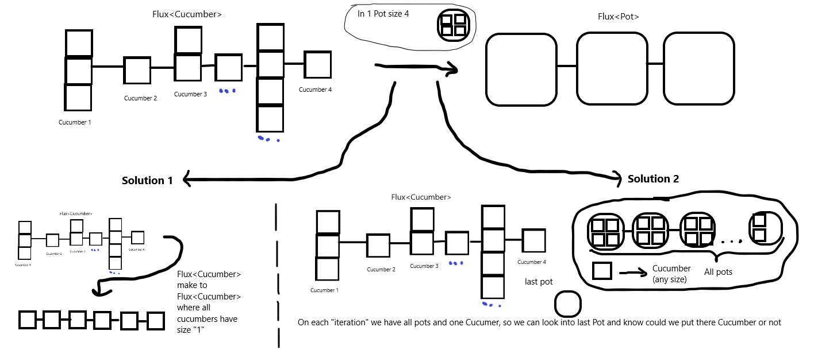

# CucumbersAndPots

## Описание проекта

Решения данной задачи:
"Eсть сущность Огурец, которая имеет поля
1. размер (объем).

Eсть сущность Банкая которая имеет поля
1. лист огурцов (содержит огурцы, которые входят в данную банку)
2. максимальное объем банки (сколько в нее может поместиться огурцов.

Необходимо написать метод, который на вход принимает Flax<Огурцов> и возвращает Flax<Банок>. Данный метод должен сгруппировать огурцы по банкам.

Примечания.
1) если цельный огурец не влазит в банку, отрезать от огурца столько, сколько может поместиться в эту банку, а часть которая осталась, положить в следующую банку."

## Логика решений

    

1)Первое решение (метод solutionOne) не подходит под условие задачи, но на мой взгляд имеет место быть.

2)Второе решение (метод solutionTwo) подходит под условие задачи, однако не учтены все возможные варианты развития событий + необходимо оптимизировать при использовании с большими потоками исходных данных.

P.s.: в коде расписана логика первого и второго решения.

## Изпользованные технологии
В проекте использовались такие технологии и библиотеки как:
 - Java 8
 - Project reactor
 - Lombok

